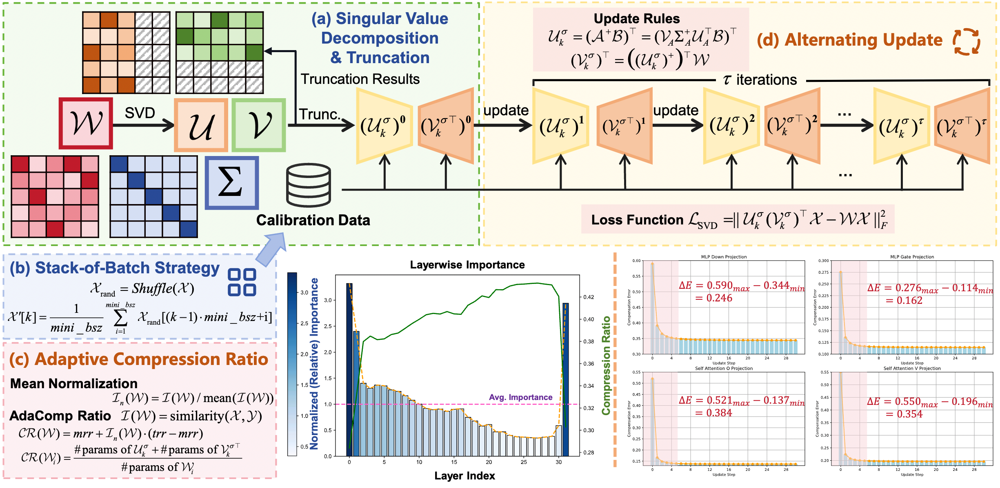
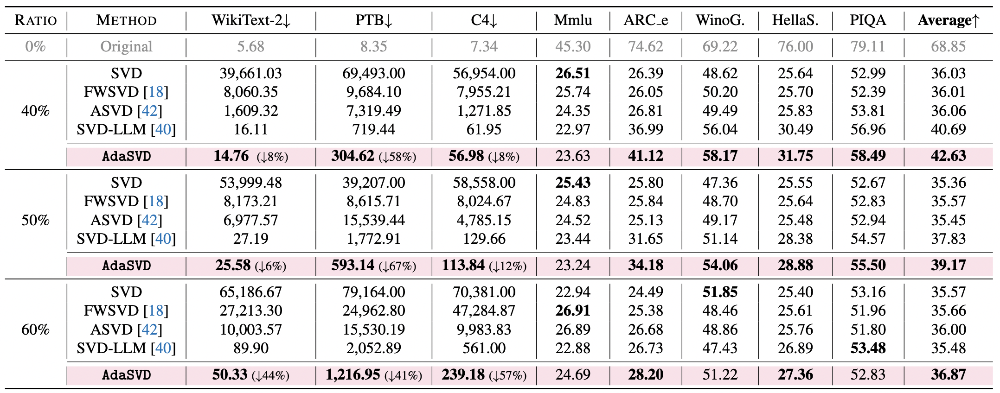
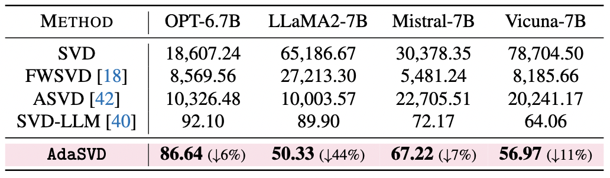
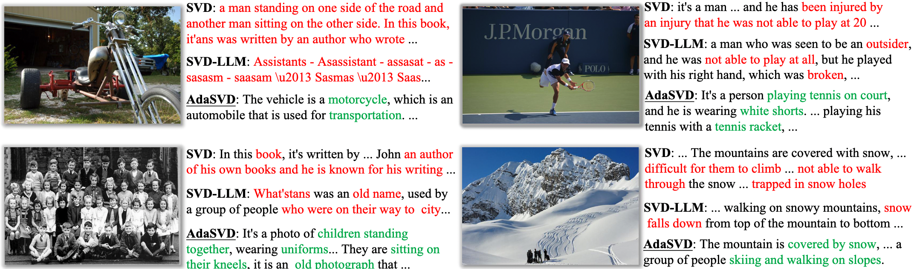

# AdaSVD: Adaptive Singular Value Decomposition for Large Language Models

[Zhiteng Li](https://zhitengli.github.io), Mingyuan Xia, [Jingyuan Zhang](https://tonyzhang-sjtu.github.io/), [Zheng Hui](https://zheng222.github.io/), [Linghe Kong](https://www.cs.sjtu.edu.cn/~linghe.kong/), [Yulun Zhang](http://yulunzhang.com/), and [Xiaokang Yang](https://scholar.google.com/citations?user=yDEavdMAAAAJ), "AdaSVD: Adaptive Singular Value Decomposition for Large Language Models", arxiv, 2025

[[arXiv](https://arxiv.org/pdf/2502.01403
)] [[supplementary material](https://github.com/ZHITENGLI/AdaSVD/releases/tag/v1)]


#### 🔥🔥🔥 News

- **2025-03-09:** This repo is released.

---

> **Abstract:** Large language models (LLMs) have achieved remarkable success in natural language processing (NLP) tasks, yet their substantial memory requirements present significant challenges for deployment on resource-constrained devices. Singular Value Decomposition (SVD) has emerged as a promising compression technique for LLMs, offering considerable reductions in memory overhead. However, existing SVD-based methods often struggle to effectively mitigate the errors introduced by SVD truncation, leading to a noticeable performance gap when compared to the original models. Furthermore, applying a uniform compression ratio across all transformer layers fails to account for the varying importance of different layers. To address these challenges, we propose AdaSVD, an adaptive SVD-based LLM compression approach. Specifically, AdaSVD introduces adaComp, which adaptively compensates for SVD truncation errors by alternately updating the singular matrices $\mathcal{U}$ and $\mathcal{V}^\top$. Additionally, AdaSVD introduces adaCR, which adaptively assigns layer-specific compression ratios based on the relative importance of each layer. Extensive experiments across multiple LLM/VLM families and evaluation metrics demonstrate that AdaSVD consistently outperforms state-of-the-art (SOTA) SVD-based methods, achieving superior performance with significantly reduced memory requirements. Code and models of AdaSVD will be available at https://github.com/ZHITENGLI/AdaSVD.




## ⚒️ TODO
 
* [ ] Complete this repository

## 🔗 Contents

- [ ] SVD compression and evaluation
- [x] [Results](#-results)
- [x] [Citation](#citation)
- [x] [Acknowledgements](#-acknowledgements)

## 🔎 Results

<details open>
<summary>AdaSVD outperforms previous state-of-the-art SVD-based LLM compression methods.</summary>

- LLaMA2 7B
<p align="center">
  
</p>

- OPT-6.7B, LLaMA2-7B, Mistral-7B, and Vicuna-7B
<p align="center">
  
</p>

</details>

<details open>
<summary>AdaSVD can also be applied to VLM models like LLaVA.</summary>

- Image captioning on COCO dataset
<p align="center">
  
</p>

</details>

## Citation

If you find the code helpful in your research or work, please cite the following paper.

```
@article{li2025adasvd,
  title={AdaSVD: Adaptive Singular Value Decomposition for Large Language Models},
  author={Li, Zhiteng and Xia, Mingyuan and Zhang, Jingyuan and Hui, Zheng and Kong, Linghe and Zhang, Yulun and Yang, Xiaokang},
  journal={arXiv e-prints},
  pages={arXiv--2502},
  year={2025}
}
```

## 💡 Acknowledgements

This work is released under the Apache 2.0 license.
The codes are based on [SVD-LLM](https://github.com/AIoT-MLSys-Lab/SVD-LLM). Please also follow their licenses. Thanks for their awesome works.
